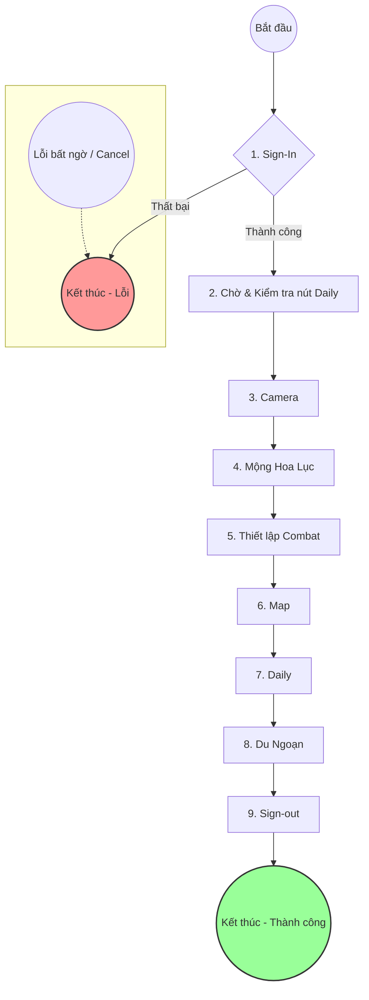

# NthFullFlowWorkflow - Sơ đồ luồng hoạt động chi tiết

## Sơ đồ tổng quan

---

## Sơ đồ chi tiết các Workflow con

```mermaid
graph TD
    A((Bắt đầu Full Flow)) --> B_entry;

    %% --- 1. SIGN-IN ---
    subgraph "CHI TIẾT: 1. Sign-In (Luồng quan trọng)"
        direction LR
        B_entry[Start Sign-In] --> B1[Đọc Excel lấy user/pass];
        B1 --> B2{"Tìm 'username_box.png'"};
        B2 -- Thấy --> B3[Nhập username -> Tab -> Nhập password];
        B2 -- Không thấy --> Z_fail((Lỗi));
        B3 --> B4{"Tìm 'login_button.png'"};
        B4 -- Thấy --> B5[Click Login];
        B4 -- Không thấy --> Z_fail;
        B5 --> B6{"Thấy popup 'checkbox.png'?"};
        B6 -- Có --> B7[Click checkbox -> Click 'agree.png'];
        B6 -- Không --> B8{"Tìm 'start_button.png'"};
        B7 --> B8;
        B8 -- Thấy --> B9[Click Start];
        B8 -- Không thấy --> Z_fail;
        B9 --> B10{"Chờ 'back_button.png' xuất hiện"};
        B10 -- Thấy --> B11{"Tìm 'start_button2.png'"};
        B10 -- Không thấy --> Z_fail;
        B11 -- Thấy --> B12[Click Start 2];
        B11 -- Không thấy --> Z_fail;
        B12 --> C_entry;
    end
    
    %% --- 2. CAMERA ---
    subgraph "CHI TIẾT: 2. Camera (Bỏ qua nếu lỗi)"
        direction TB
        C_entry[Start Camera] --> C1[Xử lý 'skip_tale_button' (nếu có)];
        C1 --> C2[Click 'camera_button.png'];
        C2 --> C3[Click giữa màn hình x3];
        C3 --> C4{"Thấy 'camera_skipbutton.png'?"};
        C4 -- Có --> C5[Click Skip -> Ấn Space];
        C4 -- Không --> C6;
        C5 --> C6{"Chờ 'camera_enterbutton.png'"};
        C6 -- Thấy --> C7[Ấn Enter -> Click giữa màn hình x2 -> Xử lý 'skip_button' (nếu có)];
        C6 -- Không thấy --> C8;
        C7 --> C8[Click 'camera_closeimage.png'];
        C8 --> C9[Click 'camera_backbutton.png'];
        C9 --> C10[Click giữa màn hình x3];
        C10 --> D_entry;
    end

    %% --- 3. MỘNG HOA LỤC ---
    subgraph "CHI TIẾT: 3. Mộng Hoa Lục (Bỏ qua nếu lỗi)"
        direction TB
        D_entry[Start MHL] --> D1[Click 'mhl_mailbox.png'];
        D1 --> D2[Click 'mhl_backbuttonn.png'];
        D2 --> D3[Click 'mhl_posttab.png'];
        D3 --> D4[Click 'mhl_discover.png'];
        D4 --> D5[Click 'mhl_like.png' x2];
        D5 --> D6[Ấn phím ESC];
        D6 --> E_entry;
    end

    %% --- 4. COMBAT ---
    subgraph "CHI TIẾT: 4. Thiết lập Combat (Bỏ qua nếu lỗi)"
        direction TB
        E_entry[Start Combat] --> E1[Ấn phím B];
        E1 --> E2[Click 'automedicine.png'];
        E2 --> E3[Click 'usemedicine.png'];
        E3 --> E4[Ấn ESC -> Ấn Y];
        E4 --> E5[Xử lý 'skip.png' (nếu có)];
        E5 --> E6[Click 'searchbutton.png' x2];
        E6 --> E7[Click 'openauto.png'];
        E7 --> E8[Click 'quickswap.png'];
        E8 --> E9[Ấn phím ESC];
        E9 --> F_entry;
    end

    %% --- 5. MAP ---
    subgraph "CHI TIẾT: 5. Map (Bỏ qua nếu lỗi)"
        direction TB
        F_entry[Start Map] --> F1[Ấn phím M];
        F1 --> F2[Click 'zoomupbutton.png' x10 (xen kẽ xử lý 'skipinstruction')];
        F2 --> F3[Click 'inputbutton.png'];
        F3 --> F4[Nhập tọa độ: 8 -> 5 -> 9];
        F4 --> F5[Click vị trí giữa -> Xóa tọa độ cũ];
        F5 --> F6[Nhập tọa độ Z: 9 -> 8 -> 3];
        F6 --> F7[Click 'follow.png'];
        F7 --> F8[Ấn phím ESC];
        F8 --> F9{"Loop x3: Ấn E x2"};
        F9 -- Lần 1, 2, 3 --> F10{"Tìm thấy 'ruong.png' hoặc 'ruong2.png'?"};
        F10 -- Có --> F11[Click rương / Ấn F -> Thoát loop];
        F10 -- Không --> F9;
        F11 --> G_entry;
    end

    %% --- 6. DAILY ---
    subgraph "CHI TIẾT: 6. Daily (Bỏ qua nếu lỗi)"
        direction TB
        G_entry[Start Daily] --> G1{"Loop: Tìm 'openbutton.png'"};
        G1 -- Không thấy --> G2[Ấn ESC, thử lại];
        G1 -- Thấy --> G3[Click Open];
        G2 --> G1;
        
        G3 --> G4{"Loop: Tất cả quest 'Done' chưa?"};
        G4 -- Rồi --> G7_2;
        G4 -- Chưa --> G5{"Tìm 1 quest chưa làm"};
        G5 -- Thấy --> G6[Click quest đó];
        G5 -- Không thấy --> G8{"Tìm và click tất cả 'reset.png'"};
        G6 --> G4;
        G8 --> G4;
        
        G7_2 --> G9{"Loop: Tìm 'dungoan.png'"};
        G9 -- Thấy --> G10[Click Dungoan];
        G9 -- Không thấy --> G11{"Tìm và click tất cả 'reset.png'"};
        G11 --> G9;
        G10 --> H_entry;
    end
    
    %% --- 7. DU NGOẠN ---
    subgraph "CHI TIẾT: 7. Du Ngoạn (Bỏ qua nếu lỗi)"
        direction TB
        H_entry[Start Du Ngoạn] --> H1[Xử lý 'skipbutton.png'];
        H1 --> H2[Click 'maintale.png'];
        H2 --> H3[Click 'startevent.png'];
        H3 --> H4{"Loop: Tìm 'godungeon.png'"};
        H4 -- Chưa thấy --> H5{"Tìm 'nameevent.png'"};
        H5 -- Thấy --> H6[Click Name Event];
        H6 --> H4;
        H5 -- Không thấy --> H7_2;
        H4 -- Thấy --> H7_2[Click Go Dungeon];

        H7_2 --> H8[Xử lý 'skip2.png'];
        H8 --> H9{"Loop: Spam phím E"};
        H9 --> H10{"Thấy 'doneevent.png'?"};
        H10 -- Có --> H11[Click Done -> Click Close -> Thoát loop];
        H10 -- Không --> H12{"Thấy 'reborn.png'?"};
        H12 -- Có --> H13[Click Reborn];
        H13 --> H9;
        H12 -- Không --> H9;

        H11 --> H14[Ấn ESC -> Click giữa màn hình -> Ấn F1];
        H14 --> H15{"Loop: Tìm 'dailydone.png'"};
        H15 -- Thấy --> H16[Click Daily Done -> Ấn ESC];
        H15 -- Không thấy --> H17[Ấn F1];
        H17 --> H15;
        H16 --> I_entry;
    end

    %% --- 8. SIGN-OUT ---
    subgraph "CHI TIẾT: 8. Sign-out (Bỏ qua nếu lỗi)"
        direction TB
        I_entry[Start Sign-out] --> I1{"Loop: Ấn ESC"};
        I1 --> I2{"Tìm 'setting.png'"};
        I2 -- Thấy --> I3[Click Setting];
        I2 -- Không thấy --> I1;
        I3 --> I4[Tìm panel 'signout.png'];
        I4 --> I5[Click nút 'signout_button.png' bên trong panel];
        I5 --> I6[Ấn phím Space];
        I6 --> I7[Chờ 'otheraccount.png' -> Click x2];
        I7 --> I8[Click 'zingsignin.png'];
        I8 --> Y_success;
    end

    %% --- End Points ---
    Y_success((Kết thúc - Thành công));
    style Y_success fill:#9f9,stroke:#333,stroke-width:2px;
    style Z_fail fill:#f99,stroke:#333,stroke-width:2px;
```
